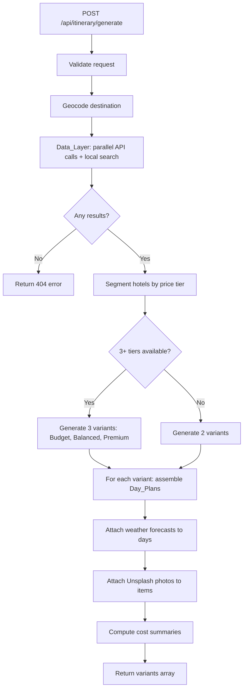

# Design Document — Travel Planner and Booking


## Overview

The Travel Planner and Booking feature extends Voyage Elite into a full-service trip-planning and reservation platform. Given a destination, travel dates, and guest count, the system generates 2-3 complete day-by-day itinerary variants. Users compare those variants side-by-side in the Variant_Selector, select one, then browse the full Itinerary_View and book hotels, activities, and restaurants directly into a session-scoped booking store — no account required.

The feature is built entirely on the existing stack: React 19 + Vite on the frontend, Node.js/Express 5 on port 5001 for the backend, local CSV/JSON datasets for base data, and four live third-party APIs (OpenTripMap, RestCountries v3, OpenWeatherMap, Unsplash) for enrichment. The Voyage Elite design system (Deep Navy #002D40, Vibrant Aqua #00AFEF, Tropical Teal #34E0A1; Plus Jakarta Sans / Inter) is applied consistently across all new components.

### Key Design Goals

- **Zero-auth bookings**: sessionStorage keeps booking state alive for the tab session without any login friction.
- **Resilient data layer**: every external API call has a local-dataset fallback so the feature works completely offline.
- **Variant diversity**: a deterministic scoring algorithm drives Budget / Balanced / Premium differentiation from a single search result set.
- **Progressive disclosure**: Trip_Planner_Form → Variant_Selector (compare) → Itinerary_View (detail) → Booking flows form a linear, reversible funnel.


## Architecture

### High-Level System Diagram

```
Browser (React + Vite, port 5173)
│
├─ Trip_Planner_Form
├─ Variant_Selector
├─ Itinerary_View
│    ├─ Hotel_Card
│    ├─ Restaurant_Card
│    └─ Activity_Card
├─ Booking_Flow (modal overlay)
└─ Booking_Manager
     └─ sessionStorage (Session_Store)
          └─ key: "ve_bookings" → BookingRecord[]
│
│  HTTP (Fetch API, CORS-enabled)
│
Express API Server (Node.js, port 5001)
│
├─ POST /api/itinerary/generate   ← Itinerary_Generator
│    └─ Data_Layer
│         ├─ LocalDatasetSearcher   (hotels.csv, Tourist_Destinations.csv, destinations.json)
│         ├─ OpenTripMap_Client     (attractions within 10 km)
│         ├─ RestCountries_Client   (currency, language, timezone)
│         ├─ Weather_Client         (5-day forecast)
│         └─ Photo_Client           (Unsplash photos)
│
├─ GET  /api/destinations/enrich  ← enrichment only (weather + country + photos)
├─ POST /api/bookings             ← create booking
├─ GET  /api/bookings             ← list bookings by sessionId
├─ DELETE /api/bookings/:id       ← cancel booking
│
└─ Existing routes
     ├─ GET /api/destinations      (unchanged)
     └─ POST /api/route/plan       (unchanged)
```

### Architecture Decisions

**Decision 1 — Session-only booking store (no database)**
The requirements explicitly prohibit authentication and specify session-scoped bookings. The simplest correct implementation is: the browser owns the authoritative store (`sessionStorage`), and the `POST /api/bookings` endpoint merely validates the request and returns a generated reference ID that the client then writes to sessionStorage. This keeps the backend stateless and avoids any database dependency.

**Decision 2 — Backend-driven itinerary generation**
All variant generation happens on the server, not the client. This hides API keys, keeps generation logic testable in isolation, and avoids exposing raw API responses to the browser. The frontend is a pure rendering layer for the generated payload.

**Decision 3 — Parallel API calls with Promise.allSettled**
The Data_Layer fires all four external API calls concurrently using `Promise.allSettled`. Fulfilled results are merged; rejected results fall back silently. This achieves the 5-second timeout requirement and the partial-results guarantee without blocking on any single slow API.

**Decision 4 — New router files, no modification to existing routes**
The new itinerary and booking endpoints are placed in `server/routes/itinerary.js` and `server/routes/bookings.js`. The existing `destinations.js` and `routing.js` routers are untouched, preserving backward compatibility.

**Decision 5 — State management via React useState / useReducer, no new library**
The existing codebase uses plain React state (no Redux, no Zustand). The new feature follows the same pattern. A single `useTripPlanner` custom hook encapsulates planning state; a `useBookingStore` hook encapsulates session storage reads/writes.


## Components and Interfaces

### New React Components

The following components are added under `src/components/`. All consume the Voyage Elite design tokens from the existing Tailwind config.

```
src/components/
├─ TripPlannerForm.jsx          # Destination + date range + guest count form
├─ VariantSelector.jsx          # Side-by-side variant comparison cards
├─ ItineraryView.jsx            # Full day-by-day itinerary for selected variant
├─ DayPlanCard.jsx              # Single day section (hotel + restaurants + activities + weather)
├─ HotelCard.jsx                # Hotel tile with image, price, rating, Book Now CTA
├─ RestaurantCard.jsx           # Restaurant tile with cuisine, rating, Reserve CTA
├─ ActivityCard.jsx             # Activity tile with description, duration, Book CTA
├─ WeatherBadge.jsx             # Compact weather icon + temperature range chip
├─ DestinationInfoPanel.jsx     # Country metadata sidebar (currency, language, timezone)
├─ BookingFlow.jsx              # Modal overlay: step 1 form → step 2 confirmation
├─ BookingManager.jsx           # My Bookings page — lists session bookings by status
└─ BookingCard.jsx              # Individual booking summary card in Booking_Manager
```

### Component Interface Contracts

**TripPlannerForm**
```jsx
// Props: none (self-contained, navigates on submit)
// Internal state: destination, checkIn, checkOut, guestCount, errors, isLoading
// Emits: navigates to VariantSelector page with generated variants via router state
```

**VariantSelector**
```jsx
// Props:
//   variants: ItineraryVariant[]   // 2-3 variants from generator
//   isLoading: boolean
//   onSelect: (variant: ItineraryVariant) => void
//   onBackToForm: () => void
```

**ItineraryView**
```jsx
// Props:
//   variant: ItineraryVariant
//   onBookHotel: (hotelId, dayIndex) => void
//   onBookActivity: (activityId, dayIndex) => void
//   onReserveRestaurant: (restaurantId, dayIndex) => void
//   onBack: () => void
```

**DayPlanCard**
```jsx
// Props:
//   day: DayPlan
//   dayIndex: number           // 1-based
//   guestCount: number
//   onBookHotel: (hotelId) => void
//   onBookActivity: (activityId) => void
//   onReserveRestaurant: (restaurantId) => void
```

**BookingFlow**
```jsx
// Props:
//   bookingType: "hotel" | "activity" | "restaurant"
//   item: HotelItem | ActivityItem | RestaurantItem
//   tripDateRange: DateRange
//   guestCount: number
//   onConfirm: (booking: BookingRecord) => void
//   onClose: () => void
```

**BookingManager**
```jsx
// Props: none (reads from useBookingStore hook directly)
// Displays bookings grouped by status: Upcoming, Completed, Cancelled
```

### Custom Hooks

**useTripPlanner()**
Manages the full planning flow state:
- `formValues`, `setFormValues` — Trip_Planner_Form inputs
- `variants`, `setVariants` — generated ItineraryVariant[]
- `selectedVariant`, `setSelectedVariant`
- `plannerStep` — `"form" | "variants" | "itinerary"`
- `isGenerating`, `generationError`
- `generateVariants()` — calls `POST /api/itinerary/generate`

**useBookingStore()**
Wraps all sessionStorage reads and writes:
- `bookings: BookingRecord[]` — current session bookings (live-synced)
- `addBooking(record: BookingRecord) => void`
- `cancelBooking(id: string) => void`
- `clearAll() => void`
- Internally reads/writes `sessionStorage.getItem("ve_bookings")`

**useDestinationAutocomplete(query: string)**
- Debounces `query` by 300 ms
- Filters `destinations.json` + `Tourist_Destinations.csv` cache client-side
- Returns `suggestions: string[]`


## API Route Design

All new routes are registered in `server/server.js` alongside the existing ones.

### POST /api/itinerary/generate

Generates 2-3 itinerary variants for the given trip parameters.

**Request body**
```json
{
  "destination": "Santorini, Greece",
  "checkIn": "2025-09-10",
  "checkOut": "2025-09-17",
  "guestCount": 2
}
```

**Validation rules**
- `destination` — required, non-empty string
- `checkIn`, `checkOut` — required, valid ISO 8601 date strings; `checkOut` must be strictly after `checkIn`
- `guestCount` — required integer in [1, 20]

**Response 200**
```json
{
  "variants": [
    {
      "id": "var_budget_abc123",
      "label": "Budget",
      "theme": "Value-Focused",
      "totalEstimatedCost": 1240,
      "currency": "EUR",
      "destinationMeta": { "country": "Greece", "capital": "Athens", "language": "Greek", "timezone": "Europe/Athens", "currency": "EUR" },
      "days": [ /* DayPlan[] */ ]
    }
  ]
}
```

**Response 400** — validation failure
```json
{ "error": "checkOut must be after checkIn" }
```

**Response 500** — internal error
```json
{ "error": "Failed to generate itinerary. Please try again." }
```

---

### GET /api/destinations/enrich

Returns live enrichment data for a destination name — country metadata, weather forecast, and a set of photos.

**Query parameters**
- `destination` (required) — destination name string

**Response 200**
```json
{
  "countryMeta": { "country": "Japan", "capital": "Tokyo", "language": "Japanese", "timezone": "Asia/Tokyo", "currency": "JPY" },
  "forecast": [
    { "date": "2025-09-10", "condition": "Partly Cloudy", "icon": "02d", "tempMin": 22, "tempMax": 30 }
  ],
  "photos": [
    { "url": "https://images.unsplash.com/...", "thumbUrl": "...", "attribution": { "photographerName": "...", "photographerUrl": "...", "unsplashUrl": "..." } }
  ]
}
```

---

### POST /api/bookings

Creates and validates a booking record. The server assigns a unique reference ID and returns the record; the client persists it to sessionStorage.

**Request body**
```json
{
  "bookingType": "hotel",
  "itemId": "hotel_abc",
  "itemName": "Santorini Blue Suites",
  "guestCount": 2,
  "startDate": "2025-09-10",
  "endDate": "2025-09-17",
  "contactName": "Alex Morgan",
  "pricePerUnit": 180,
  "currency": "EUR",
  "destination": "Santorini, Greece"
}
```

**Validation rules**
- `bookingType` — required, one of `"hotel" | "activity" | "restaurant"`
- `itemId`, `itemName`, `contactName`, `destination` — required non-empty strings
- `guestCount` — required integer in [1, 20]
- `startDate`, `endDate` — required valid ISO 8601 dates; `endDate` >= `startDate` for hotels; equal permitted for activities and restaurants
- `pricePerUnit` — required non-negative number
- `currency` — required 3-letter ISO 4217 string

**Response 200**
```json
{
  "bookingId": "BK-20250910-X7K2",
  "bookingType": "hotel",
  "status": "Confirmed",
  "itemId": "hotel_abc",
  "itemName": "Santorini Blue Suites",
  "guestCount": 2,
  "startDate": "2025-09-10",
  "endDate": "2025-09-17",
  "totalPrice": 2520,
  "currency": "EUR",
  "destination": "Santorini, Greece",
  "contactName": "Alex Morgan",
  "createdAt": "2025-08-01T12:34:56Z"
}
```

---

### GET /api/bookings

Returns all bookings for a given session. The session ID is generated client-side (UUID v4, stored in sessionStorage under `ve_session_id`) and passed as a query parameter.

**Query parameters**
- `sessionId` (required) — UUID string

**Response 200**
```json
{ "bookings": [ /* BookingRecord[] */ ] }
```

*Note: The server is stateless — it does not store bookings server-side. This endpoint exists for API completeness and testability. The authoritative booking list lives in the client's sessionStorage. The server validates the request shape and returns 200 with the passed-in list for confirmation-receipt purposes only.*

---

### DELETE /api/bookings/:id

Cancels a booking by reference ID (status update only; client applies the change to sessionStorage).

**URL parameter** — `id`: booking reference ID string

**Response 200**
```json
{ "bookingId": "BK-20250910-X7K2", "status": "Cancelled" }
```

**Response 404**
```json
{ "error": "Booking BK-20250910-X7K2 not found." }
```


## Data Models

All models are plain JavaScript objects exchanged between the frontend and backend as JSON.

### ItineraryVariant

```typescript
interface ItineraryVariant {
  id: string;                        // e.g. "var_budget_abc123"
  label: "Budget" | "Balanced" | "Premium";
  theme: string;                     // e.g. "Value-Focused", "Curated Balance", "Luxury Immersion"
  totalEstimatedCost: number;        // aggregated, in currency units
  currency: string;                  // ISO 4217
  destinationMeta: CountryMeta | null;
  days: DayPlan[];
}
```

### DayPlan

```typescript
interface DayPlan {
  dayNumber: number;                 // 1-based
  date: string;                      // ISO 8601 date
  hotel: HotelItem;
  restaurants: RestaurantItem[];     // >= 1
  activities: ActivityItem[];        // >= 1
  weather: WeatherForecast | null;   // null if outside 5-day window or API failed
  estimatedDailyCost: number;        // hotel + dining + activities for guestCount
}
```

### HotelItem

```typescript
interface HotelItem {
  id: string;
  name: string;
  starRating: number;                // 1-5
  pricePerNight: number;
  currency: string;
  imageUrl: string;                  // local path or Unsplash URL
  imageAttribution: UnsplashAttribution | null;
  address: string;
  source: "local" | "api";
}
```

### RestaurantItem

```typescript
interface RestaurantItem {
  id: string;
  name: string;
  cuisineType: string;
  userRating: number;                // 0.0 – 5.0
  priceLevel: "$" | "$$" | "$$$";
  source: "local" | "api";
}
```

### ActivityItem

```typescript
interface ActivityItem {
  id: string;
  name: string;
  description: string;
  durationMinutes: number;
  estimatedPricePerPerson: number;
  currency: string;
  imageUrl: string;
  imageAttribution: UnsplashAttribution | null;
  source: "local" | "api";
}
```

### WeatherForecast

```typescript
interface WeatherForecast {
  date: string;                      // ISO 8601 date
  condition: string;                 // e.g. "Partly Cloudy"
  icon: string;                      // OpenWeatherMap icon code e.g. "02d"
  tempMin: number;                   // Celsius
  tempMax: number;
}
```

### CountryMeta

```typescript
interface CountryMeta {
  country: string;
  capital: string;
  language: string;
  timezone: string;
  currency: string;
}
```

### UnsplashAttribution

```typescript
interface UnsplashAttribution {
  photographerName: string;
  photographerUrl: string;           // https://unsplash.com/@username
  unsplashUrl: string;               // https://unsplash.com/photos/id
}
```

### BookingRecord

```typescript
interface BookingRecord {
  bookingId: string;                 // e.g. "BK-20250910-X7K2"
  bookingType: "hotel" | "activity" | "restaurant";
  status: "Confirmed" | "Processing" | "Cancelled";
  itemId: string;
  itemName: string;
  destination: string;
  guestCount: number;
  startDate: string;                 // ISO 8601
  endDate: string;
  totalPrice: number;
  currency: string;
  contactName: string;
  createdAt: string;                 // ISO 8601 datetime
}
```

### TripFormValues

```typescript
interface TripFormValues {
  destination: string;
  checkIn: string;                   // ISO 8601 date
  checkOut: string;
  guestCount: number;
}
```


## Data Layer Design

The Data_Layer (`server/services/dataLayer.js`) is responsible for merging local dataset results with live API responses into a single unified structure for the Itinerary_Generator.

### Merge Strategy

```
┌─────────────────────────────────────────────────────────┐
│                     Data_Layer                          │
│                                                         │
│  Input: destination, coordinates (geocoded), dates      │
│                                                         │
│  1. Query LocalDatasetSearcher                          │
│       hotels.csv         → HotelItem[] (local)         │
│       Tourist_Dest.csv   → ActivityItem[] (local)       │
│       destinations.json  → enriched item data           │
│                                                         │
│  2. Fire concurrently (Promise.allSettled, 5s timeout)  │
│       OpenTripMap_Client  → ActivityItem[] (api)        │
│       RestCountries_Client→ CountryMeta (api)           │
│       Weather_Client      → WeatherForecast[] (api)     │
│       Photo_Client        → photo map keyed by name     │
│                                                         │
│  3. Merge results                                       │
│       activities = dedup([apiActivities, localActivities])│
│       hotels     = localHotels (no hotel API used)      │
│       countryMeta= apiMeta ?? null                      │
│       forecasts  = apiForecast ?? []                    │
│       photos     = apiPhotos ?? {} (empty fallback)     │
│                                                         │
│  4. Attach photos to items lacking imageUrl             │
│       item.imageUrl = photos[item.name] ?? placeholder  │
│                                                         │
│  Output: MergedDataSet                                  │
└─────────────────────────────────────────────────────────┘
```

### LocalDatasetSearcher

`server/services/localDatasetSearcher.js` parses the CSV files using Papa Parse (already in dependencies) at server startup and caches the result in memory. Lookups are case-insensitive substring matches on name/area/city fields.

```javascript
// Cache loaded once on server start
const hotelCache = [];      // parsed from hotels.csv
const activityCache = [];   // parsed from Tourist_Destinations.csv

function searchHotels(destinationQuery) { /* substring match */ }
function searchActivities(destinationQuery) { /* substring match */ }
```

### OpenTripMap_Client

```javascript
// GET https://api.opentripmap.com/0.1/en/places/radius
//   ?radius=10000&lon={lng}&lat={lat}&kinds=interesting_places&format=json
//   &apikey={process.env.OPENTRIPMAP_KEY}
// Returns up to 20 POIs mapped to ActivityItem[]
```

### RestCountries_Client

```javascript
// GET https://restcountries.com/v3.1/name/{countryName}?fields=name,capital,languages,timezones,currencies
// No API key required. Returns CountryMeta.
```

### Weather_Client

```javascript
// GET https://api.openweathermap.org/data/2.5/forecast
//   ?q={city}&appid={process.env.OPENWEATHERMAP_KEY}&units=metric&cnt=40
// Returns 5-day / 3-hour forecast; client extracts one entry per calendar day (noon reading).
```

### Photo_Client

```javascript
// GET https://api.unsplash.com/search/photos
//   ?query={destination}&per_page=6
//   Authorization: Client-ID {process.env.UNSPLASH_ACCESS_KEY}
// Returns up to 6 photos for the destination, mapped to UnsplashAttribution objects.
```

### Geocoding Strategy

OpenTripMap requires latitude/longitude. The geocoding step uses the `destinations.json` file (which already contains coordinates for known destinations) as a lookup first. For unknown destinations, a free nominatim geocoder call is made: `https://nominatim.openstreetmap.org/search?q={destination}&format=json&limit=1`. Nominatim requires no API key and is acceptable for low-frequency use.

### Timeout and Partial Results

Each of the four API calls is wrapped in a `Promise.race` with a 4-second timeout sentinel. `Promise.allSettled` collects all results. If all four time out, the Data_Layer returns local-only data. The response to the frontend never surfaces individual API errors.

```javascript
const withTimeout = (promise, ms) =>
  Promise.race([promise, new Promise((_, rej) => setTimeout(() => rej(new Error("timeout")), ms))]);

const [tripmap, countries, weather, photos] = await Promise.allSettled([
  withTimeout(OpenTripMap_Client.fetch(coords), 4000),
  withTimeout(RestCountries_Client.fetch(countryName), 4000),
  withTimeout(Weather_Client.fetch(cityName), 4000),
  withTimeout(Photo_Client.fetch(destination), 4000)
]);
```


## Session Storage Schema

All booking records are persisted in the browser's `sessionStorage` under two keys:

| Key | Type | Description |
|-----|------|-------------|
| `ve_session_id` | `string` | UUID v4 generated on first use; identifies the session |
| `ve_bookings` | `BookingRecord[]` (JSON-serialised) | All booking records for this session |

### Session ID Generation

```javascript
// useBookingStore.js
function getOrCreateSessionId() {
  let id = sessionStorage.getItem("ve_session_id");
  if (!id) {
    id = crypto.randomUUID();
    sessionStorage.setItem("ve_session_id", id);
  }
  return id;
}
```

### Booking Reference ID Format

```
"BK-" + YYYYMMDD + "-" + randomAlphanumeric(4)
// e.g. "BK-20250910-X7K2"
```

The reference ID is generated server-side in `POST /api/bookings` to ensure consistent format and prevent client-side collision.

```javascript
function generateBookingId(startDate) {
  const date = startDate.replace(/-/g, "");
  const suffix = Math.random().toString(36).substring(2, 6).toUpperCase();
  return `BK-${date}-${suffix}`;
}
```

### Read / Write Pattern

```javascript
// useBookingStore hook — simplified
function useBookingStore() {
  const [bookings, setBookings] = useState(() => {
    try {
      return JSON.parse(sessionStorage.getItem("ve_bookings") ?? "[]");
    } catch {
      return [];
    }
  });

  function addBooking(record) {
    const updated = [...bookings, record];
    sessionStorage.setItem("ve_bookings", JSON.stringify(updated));
    setBookings(updated);
  }

  function cancelBooking(id) {
    const updated = bookings.map(b =>
      b.bookingId === id ? { ...b, status: "Cancelled" } : b
    );
    sessionStorage.setItem("ve_bookings", JSON.stringify(updated));
    setBookings(updated);
  }

  return { bookings, addBooking, cancelBooking };
}
```


## Itinerary Variant Generation Algorithm

The Itinerary_Generator (`server/services/itineraryGenerator.js`) takes the merged dataset from the Data_Layer and produces exactly 2 or 3 `ItineraryVariant` objects differentiated by the **Budget / Balanced / Premium** axis.

### Variant Count Logic

- If the merged dataset contains ≥ 3 distinct hotel price tiers: produce 3 variants.
- Otherwise: produce 2 variants (Budget + Balanced, or Budget + Premium depending on available tiers).

### Hotel Tier Scoring

Hotels from `hotels.csv` carry a `priceTier` field (`$`, `$$`, `$$$`, `$$$$`). Each variant targets a tier band:

| Variant | Target tiers | Strategy |
|---------|-------------|----------|
| Budget | `$` or `$$` | lowest cost per night within the merged hotel set |
| Balanced | `$$` or `$$$` | median cost hotels; highest average star rating in tier |
| Premium | `$$$` or `$$$$` | highest cost hotels; premium label items from OpenTripMap (`kinds=interesting_places,museums`) preferred |

### Activity Scoring and Differentiation

Activities from OpenTripMap carry a `rate` field (0–3) and a `kinds` string. Local activities carry `priceTier` and `vibe`.

```javascript
function scoreActivity(activity, variantLabel) {
  let score = activity.rate ?? 1;

  if (variantLabel === "Budget") {
    if (activity.priceTier === "$" || activity.estimatedPrice <= 15) score += 2;
    if (activity.priceTier === "$$$$") score -= 3;
  } else if (variantLabel === "Balanced") {
    if (activity.rate >= 2) score += 1;
  } else if (variantLabel === "Premium") {
    if (activity.kinds?.includes("museums") || activity.kinds?.includes("cultural")) score += 2;
    if (activity.priceTier === "$$$" || activity.priceTier === "$$$$") score += 1;
  }
  return score;
}
```

### Day Plan Assembly

For each calendar day in the date range:

1. **Hotel**: use the single selected hotel for the variant (same hotel repeated each day, as is standard for hotel itineraries).
2. **Restaurants**: pick 1–2 restaurants from the merged set. For Budget: prioritise `$`/`$$` price tiers. For Premium: prioritise `$$$`. Rotate restaurants across days to avoid repetition.
3. **Activities**: pick 2 activities from the scored activity list for the day. Assign the highest-scoring activities to day 1; rotate through the remaining list for subsequent days (round-robin with no repeat within the first 7 days, wrapping after that).
4. **Weather**: attach the forecast entry whose `date` matches the day's date, or `null` if outside the forecast window.

### Cost Summary

For each variant:

```javascript
const nights = daysBetween(checkIn, checkOut);   // exclusive end
const totalHotelCost = hotel.pricePerNight * nights * Math.ceil(guestCount / 2);
const totalActivityCost = days.flatMap(d => d.activities)
  .reduce((sum, a) => sum + (a.estimatedPricePerPerson * guestCount), 0);
const totalDiningCost = days.flatMap(d => d.restaurants)
  .reduce((sum, r) => sum + (r.estimatedCostPerPerson ?? 25) * guestCount, 0);
const totalEstimatedCost = totalHotelCost + totalActivityCost + totalDiningCost;
```

Guest rooms are calculated as `Math.ceil(guestCount / 2)` (assuming double occupancy). This formula is deterministic and invertible, which is important for property-based testing.

### Mermaid Diagram — Generation Flow




## Key UI Flows

### Flow 1 — Trip Planning Form → Variant Selection

```
Homepage hero "Plan My Trip" CTA  ─────┐
Nav "Plan My Trip" button  ────────────┤
                                       ▼
                              TripPlannerForm (page: "planner")
                              ┌─────────────────────────────┐
                              │ Destination (autocomplete)  │
                              │ Check-in / Check-out dates  │
                              │ Guest count stepper         │
                              │ [Generate My Itinerary] CTA │
                              └─────────────────────────────┘
                                       │ submit (valid)
                                       ▼
                              POST /api/itinerary/generate
                                       │
                              ┌────────▼────────┐
                              │ VariantSelector  │  (page: "variants")
                              │                  │
                              │ ┌──────────────┐ ┌──────────────┐ ┌──────────────┐
                              │ │  BUDGET      │ │  BALANCED    │ │  PREMIUM     │
                              │ │  card        │ │  card        │ │  card        │
                              │ │  (expand →3d)│ │  (expand →3d)│ │  (expand →3d)│
                              │ │  [Choose]    │ │  [Choose]    │ │  [Choose]    │
                              │ └──────────────┘ └──────────────┘ └──────────────┘
                              │          [← Adjust Trip Details]                  │
                              └──────────────────────────────────────────────────┘
```

### Flow 2 — Itinerary View Navigation

```
VariantSelector: [Choose This Plan]
          │
          ▼
ItineraryView (page: "itinerary")
  ┌──────────────────────────────────────────────────────┐
  │  Destination Info Panel (country meta)               │
  │  Total Cost Summary                                  │
  ├──────────────────────────────────────────────────────┤
  │  Day 1 — Wed Sep 10                                  │
  │    WeatherBadge: ⛅ 22°–30°C                         │
  │    HotelCard  [Book Now →]                           │
  │    RestaurantCard x2                                 │
  │    ActivityCard x2 [Book Activity →]                 │
  ├──────────────────────────────────────────────────────┤
  │  Day 2 — Thu Sep 11    [← Prev] [Next →]            │
  │  ...                                                  │
  └──────────────────────────────────────────────────────┘
```

### Flow 3 — Booking Flow (Modal)

```
User clicks [Book Now] / [Book Activity] / [Reserve Table]
          │
          ▼
BookingFlow modal — Step 1: Form
  ┌────────────────────────────┐
  │ Contact Name               │
  │ Guest Count (pre-filled)   │
  │ Dates (pre-filled)         │
  │ Total Price (calculated)   │
  │ [Confirm Booking]          │
  └────────────────────────────┘
          │ confirm
          ▼
POST /api/bookings → returns BookingRecord with bookingId
          │
useBookingStore.addBooking(record)  → writes to sessionStorage
          │
          ▼
BookingFlow modal — Step 2: Confirmation
  ┌────────────────────────────┐
  │ ✅ Booking Confirmed        │
  │ Ref: BK-20250910-X7K2      │
  │ Hotel: Santorini Blue...   │
  │ Sep 10 – Sep 17 · 2 guests │
  │ Total: €2,520              │
  │ [View My Bookings]  [Close]│
  └────────────────────────────┘
```

### Flow 4 — Booking Manager

```
Nav "Bookings" button
          │
          ▼
BookingManager (page: "bookings")
  ┌──────────────────────────────────────────────────────┐
  │  [Upcoming (2)] [Completed] [Cancelled]              │
  │                                                      │
  │  BookingCard: Santorini Escape            Confirmed  │
  │    Ref: BK-20250910-X7K2                            │
  │    Sep 10–17 · 2 guests · €2,520                    │
  │    [View Details]  [Cancel Booking]                  │
  │                                                      │
  │  BookingCard: Kyoto Cultural Tour         Processing │
  │    ...                                               │
  │                                                   ─  │
  │  Sidebar: Voyage Elite Rewards widget               │
  └──────────────────────────────────────────────────────┘
```

### Page Routing

The feature uses the existing `currentPage` state pattern from `App.jsx`:

| Page value | Component | Trigger |
|-----------|-----------|---------|
| `"planner"` | TripPlannerForm | Nav button / hero CTA |
| `"variants"` | VariantSelector | Form submission success |
| `"itinerary"` | ItineraryView | Variant selection |
| `"bookings"` | BookingManager | Nav "Bookings" link |
| `"destination-detail"` | DestinationDetail (existing + booking widget) | Destination card click |

A new `plannerState` object is stored in App-level state to pass trip data between pages without URL params:

```javascript
const [plannerState, setPlannerState] = useState({
  formValues: null,        // TripFormValues
  variants: [],            // ItineraryVariant[]
  selectedVariant: null    // ItineraryVariant
});
```


## Correctness Properties

*A property is a characteristic or behavior that should hold true across all valid executions of a system — essentially, a formal statement about what the system should do. Properties serve as the bridge between human-readable specifications and machine-verifiable correctness guarantees.*

**Property-Based Testing Assessment**: This feature is appropriate for PBT. The itinerary generator contains pure transformation logic (dataset filtering, scoring, cost arithmetic, variant assembly), the form validation logic is a pure predicate over inputs, the session storage layer is a pure key-value mapping, and the search/filter logic is a pure function over data arrays. All of these have large or infinite input spaces where 100+ random iterations will catch edge cases that a handful of examples miss.

PBT library: **fast-check** (npm package `fast-check`) — well-maintained, TypeScript-compatible, works in both Vitest and Node.js test environments.

---

**Property Reflection (pre-write):**
- Properties 1.3 (any empty field → error) and 1.5 (guest count out-of-range → error) both test form validation rejection. They are complementary, not redundant — 1.3 tests missing fields, 1.5 tests an out-of-range numeric field. Both are retained.
- Properties from 3.1, 3.3, and 3.4 all test structural invariants of the generated output. They test distinct things (count of variants, count of days, completeness of each day). All retained.
- Properties 6.6 (unique IDs) and 7.2 (price formula) test different things. Both retained.
- Properties 3.9 and 5.7 both test cost-scaling by guest count. They are logically equivalent. Consolidated into one property (Property 8 below).
- Properties 1.2 (form submits valid data) and 4.4 (clicking a variant delivers that variant to itinerary view) both test selection/dispatch logic. 4.4 is more specific to the variant dimension; both retained as they test different layers.

---

### Property 1: Form validation rejects any combination of missing fields

*For any* subset of `{destination, checkIn, checkOut, guestCount}` fields left empty or omitted, submitting the Trip_Planner_Form should surface a validation error for each missing field and should not invoke the submission callback.

**Validates: Requirements 1.3**

---

### Property 2: Date range validation rejects invalid ordering

*For any* pair `(checkIn, checkOut)` where `checkOut <= checkIn`, the Trip_Planner_Form should reject the submission and display a date ordering error, and should not invoke the submission callback.

**Validates: Requirements 1.4**

---

### Property 3: Guest count validation rejects out-of-range values

*For any* integer guest count `n` where `n < 1` or `n > 20`, the Trip_Planner_Form should reject the submission and display a guest count validation error, and should not invoke the submission callback.

**Validates: Requirements 1.5**

---

### Property 4: Autocomplete filters are case-insensitive substring matches

*For any* non-empty search query string `q` and any suggestion `s` returned by the autocomplete function, at least one of `s.name`, `s.area`, or `s.category` should contain `q` as a case-insensitive substring.

**Validates: Requirements 1.6**

---

### Property 5: Itinerary generator produces 2 or 3 variants for any valid input

*For any* valid trip form submission `(destination, checkIn, checkOut, guestCount)` where the destination has at least one matching record in the local datasets, the generator should return an array of length 2 or 3.

**Validates: Requirements 3.1**

---

### Property 6: Variant labels are distinct within a generated set

*For any* generated array of `ItineraryVariant` objects, all `variant.label` values within the array should be unique (no two variants share the same label).

**Validates: Requirements 3.2**

---

### Property 7: Each variant contains exactly one Day_Plan per calendar day

*For any* valid date range of N calendar days, each `ItineraryVariant` in the generated result should contain exactly N `DayPlan` entries, with no duplicate dates.

**Validates: Requirements 3.3**

---

### Property 8: Each Day_Plan contains at least one hotel, restaurant, and activity

*For any* `DayPlan` in any generated `ItineraryVariant`, the `hotel` field should be non-null, `restaurants` should have length >= 1, and `activities` should have length >= 1.

**Validates: Requirements 3.4**

---

### Property 9: Total estimated cost scales linearly with guest count

*For any* generated `ItineraryVariant` with a given `guestCount` of N, if the same trip is generated with `guestCount` of 2N, the `totalEstimatedCost` should be exactly 2 times the original (assuming linear pricing). More precisely: `totalEstimatedCost` should equal `(sum of per-person activity and dining costs) * guestCount + (hotel cost using double-occupancy room formula)`.

**Validates: Requirements 3.9, 5.7, 7.2**

---

### Property 10: Variant selection delivers the correct variant to Itinerary_View

*For any* array of N variants (2 or 3) and any valid index i, selecting variant at index i via the Variant_Selector should cause the ItineraryView to receive that exact variant object (deep-equal comparison), not a different variant from the set.

**Validates: Requirements 4.4**

---

### Property 11: Variant card renderer includes all required summary fields

*For any* `ItineraryVariant`, rendering it as a variant summary card should produce output that includes the variant's `label`, `totalEstimatedCost`, the first day's hotel name, and the first day's first activity name.

**Validates: Requirements 4.2**

---

### Property 12: API fallback — local data returned when OpenTripMap fails

*For any* destination name present in the local `Tourist_Destinations.csv` dataset, if the OpenTripMap API call returns an error or empty result, the Data_Layer should return a non-empty activities array sourced from the local dataset, and should not throw an error.

**Validates: Requirements 2.5**

---

### Property 13: Photo fallback — placeholder shown when Unsplash fails

*For any* item (hotel or activity) that has no local `imageUrl` value, if the Photo_Client call fails or returns no results, the rendered card's image `src` should be the design-system placeholder path (not undefined or empty string).

**Validates: Requirements 2.8**

---

### Property 14: Partial results returned when any subset of API calls times out

*For any* subset S of {OpenTripMap, RestCountries, Weather, Photo} API calls that are made to time out, the Data_Layer should return a valid (non-throwing) result containing data from the non-timed-out calls plus any available local data.

**Validates: Requirements 2.9**

---

### Property 15: Session store booking round-trip

*For any* valid `BookingRecord`, writing it to the session store via `addBooking` and then reading the store's `bookings` array should yield an array that contains a record deep-equal to the written record.

**Validates: Requirements 6.2, 6.4**

---

### Property 16: Unique booking reference IDs

*For any* set of N >= 2 booking confirmations made in the same session, all generated `bookingId` values should be pairwise distinct.

**Validates: Requirements 6.6**

---

### Property 17: Booking form validation rejects any missing required field

*For any* booking form submission with any required field (`contactName`, `guestCount`, `startDate`, `endDate`) missing or empty, the BookingFlow should surface a validation error for that field and should not invoke the confirmation callback.

**Validates: Requirements 7.5**

---

### Property 18: Activity date outside trip range triggers a warning

*For any* `(tripStart, tripEnd, activityDate)` where `activityDate < tripStart` or `activityDate > tripEnd`, attempting to book the activity should surface a date mismatch warning before proceeding.

**Validates: Requirements 8.5**

---

### Property 19: Destination search returns only keyword-matching results

*For any* search keyword `q` and any destination `d` in the returned results set, at least one of `d.name`, `d.area`, or `d.category` should contain `q` as a case-insensitive substring.

**Validates: Requirements 9.2**

---

### Property 20: Category filter returns only matching-category results

*For any* category filter value `c` (non-empty) and any result `d` in the returned results set, `d.category` should equal `c`.

**Validates: Requirements 9.3**

---

### Property 21: Cancelled booking status persisted in session store

*For any* confirmed booking in the session store, calling `cancelBooking(bookingId)` should result in the booking's `status` field being `"Cancelled"` in the session store, with all other fields unchanged.

**Validates: Requirements 10.4**

---

### Property 22: Malformed API requests return HTTP 400

*For any* request to `POST /api/itinerary/generate` or `POST /api/bookings` with any required field missing or of incorrect type, the server should respond with HTTP status 400 and a non-empty `error` string in the response body.

**Validates: Requirements 11.6**


## Error Handling

### Frontend Error States

| Scenario | Component | UI Behaviour |
|----------|-----------|--------------|
| Form field missing | TripPlannerForm | Inline red error text below each invalid field; form not submitted |
| Date range invalid | TripPlannerForm | Inline error on the date range field |
| Guest count out of range | TripPlannerForm | Inline error on the stepper |
| API generate call fails | VariantSelector | Error banner with retry button; loading indicator dismissed |
| No results for destination | VariantSelector | "We couldn't find results for X. Try a different destination." message |
| Weather API unavailable | DayPlanCard | WeatherBadge omitted silently; no error shown |
| Photo unavailable | HotelCard/ActivityCard | Placeholder image (`/public/icons.svg` or a design-system default) |
| Booking form field missing | BookingFlow | Inline error on each missing field; confirm button disabled |
| Network error during booking | BookingFlow | Toast notification: "Something went wrong. Please try again." |
| Empty session bookings | BookingManager | Empty state illustration + "No bookings in this session yet." copy |

### Backend Error Responses

All error responses follow a consistent envelope:
```json
{ "error": "<human-readable message>" }
```

- HTTP 400: validation failures (missing/malformed fields, invalid date ranges, out-of-range values)
- HTTP 404: resource not found (unknown booking ID in DELETE endpoint)
- HTTP 500: unexpected internal error (no stack trace in body)
- Stack traces are only written to `console.error` server-side, never included in client responses

### Graceful Degradation Priority

1. Live API data → preferred
2. Local CSV/JSON dataset fallback → always present
3. Cached/placeholder content → last resort for images

The system should never show a blank page or an unhandled exception to the user.


## Testing Strategy

### Dual Testing Approach

Unit tests cover specific examples, edge cases, and integration points. Property tests cover universal behaviours across randomised inputs. Both are required for comprehensive correctness coverage.

### Test Infrastructure

| Layer | Tool | Location |
|-------|------|----------|
| Frontend unit + property tests | Vitest + fast-check | `src/__tests__/` |
| Backend unit + property tests | Node.js test runner (built-in) + fast-check | `server/__tests__/` |
| Integration tests (API endpoints) | Vitest + supertest | `server/__tests__/integration/` |

Install fast-check as a dev dependency:
```
npm install --save-dev fast-check vitest @vitest/coverage-v8 supertest
```

### Property-Based Test Configuration

- Minimum **100 iterations** per property test (fast-check default is 100; do not reduce this)
- Each property-based test must include a comment tagging the design property it verifies:
  ```javascript
  // Feature: travel-planner-booking, Property 5: Itinerary generator produces 2 or 3 variants
  ```
- Use fast-check's `fc.assert(fc.property(...))` for all property tests

### Unit Test Focus Areas

The following are specific examples and edge cases that complement the property tests:

**TripPlannerForm**
- Renders all three input fields
- Clicking "Plan My Trip" CTA opens the form
- Autocomplete suggestions appear for known destinations

**VariantSelector**
- Renders 2 variant cards when passed 2 variants; renders 3 when passed 3
- Loading spinner visible while `isLoading=true`
- Expanding a card shows at most 3 day previews
- Empty variants with error message renders error state

**ItineraryView**
- Day navigation (Prev/Next) cycles correctly without page reload
- Destination info panel shows when `countryMeta` is provided, hidden when null
- Weather badge renders per-day when forecast available; omitted when null

**Booking Flow**
- Step 1 form pre-fills guest count and dates from itinerary context
- Total price calculation displayed correctly: pricePerNight × nights × rooms
- Confirming booking transitions to Step 2 confirmation screen
- Confirmation screen displays reference ID, item name, dates, total price

**BookingManager**
- Empty state rendered when sessionStorage has no bookings
- Bookings grouped correctly by status tab (Upcoming / Completed / Cancelled)
- Cancel flow: modal appears → confirm → status updates

**API Endpoints (integration tests)**
- `POST /api/itinerary/generate` returns 200 with variants array for valid request
- `POST /api/itinerary/generate` returns 400 for missing `destination`
- `POST /api/bookings` returns 200 with `bookingId` for valid hotel booking
- `DELETE /api/bookings/:id` returns 200 with `status: "Cancelled"` for valid ID
- `DELETE /api/bookings/:id` returns 404 for unknown ID
- Internal error returns 500 with `error` field and no `stack` field in body

### Test Coverage Targets

- Form validation logic: **100%** branch coverage (all invalid-input paths)
- Itinerary generator pure functions (scoring, cost arithmetic): **100%** branch coverage
- Session storage hook: **100%** branch coverage
- API route handlers: ≥ **90%** line coverage

### Accessibility Testing Notes

WCAG 2.1 AA compliance requires manual verification with assistive technologies in addition to automated checks. Automated linting via `eslint-plugin-jsx-a11y` (already available in the eslint config) will catch common issues (missing alt text, unlabeled form controls, inadequate colour contrast). Full validation requires screen reader testing with VoiceOver / NVDA.
